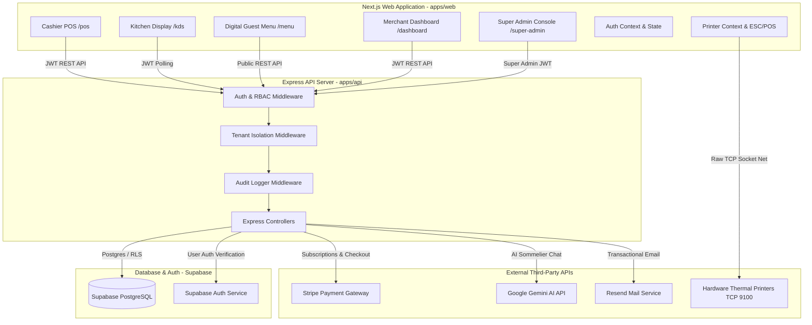

# DinePosAi - System Architecture

## 📐 Architecture Diagram



---

## 🏛 Monorepo Package Architecture

The system is configured as a **pnpm workspace** monorepo:

```
+------------------------------------------------------------------+
|                     apps/web (Next.js 16)                        |
+------------------------------------------------------------------+
        |                                          |
        | Uses Shared Types                        | Makes HTTP API Requests
        v                                          v
+------------------------------------+   +-------------------------+
| packages/shared-types (TS Schemas) |   |  apps/api (Express Node)|
+------------------------------------+   +-------------------------+
                                                   |
                                                   | Postgres Queries / Auth
                                                   v
                                         +-------------------------+
                                         | Supabase DB & Auth      |
                                         +-------------------------+
```

1. **`packages/shared-types`**: Central repository for all domain entity types (`Order`, `MenuItem`, `Tenant`, `User`), enum constants (`OrderStatus`, `UserRole`, `PaymentMethod`), permission dictionaries (`PERMISSIONS`, `DEFAULT_ROLE_PERMISSIONS`), and unified API envelope interfaces (`ApiResponse<T>`).
2. **`apps/api`**: Express REST API backend written in TypeScript. Imports `@dineposai/shared-types` via monorepo workspace protocol (`"workspace:*"`).
3. **`apps/web`**: Next.js 16 frontend using App Router. Imports `@dineposai/shared-types` for component props and API response handling.

---

## 🔄 End-to-End Request & Security Pipeline

When an incoming HTTP request reaches the backend server ([server.ts](file:///h:/Antigravity/DinePosAi/apps/api/src/server.ts)), it passes through a multi-stage security pipeline:

```
[Incoming Request]
       │
       ▼
 1. CORS Middleware (Validates Origin against FRONTEND_URL whitelist)
       │
       ▼
 2. Express JSON Parser (Captures rawBody for /api/billing/webhook)
       │
       ▼
 3. Security Headers Middleware (Applies XSS, Frameguard, NoSniff)
       │
       ▼
 4. Rate Limiter (Global Limiter / Auth Limiter / Concierge Limiter)
       │
       ▼
 5. Pino HTTP Logger (Structured request/response logging)
       │
       ▼
 6. Route Match (/api/orders, /api/inventory, etc.)
       │
       ▼
 7. requireAuth Middleware (Validates JWT Bearer token, checks user_sessions)
       │
       ▼
 8. validateOrganizationActive Middleware (Verifies tenant status is ACTIVE)
       │
       ▼
 9. requireOrganizationMatch Middleware (Validates target tenant_id matches JWT context)
       │
       ▼
10. requirePermission Middleware (Verifies user role/custom permissions)
       │
       ▼
11. Zod Schema Validation Middleware (Validates req.body schema)
       │
       ▼
12. Controller Execution (Performs business logic & DB interaction via Supabase client)
       │
       ▼
13. auditLogger Post-Response Handler (Inserts audit_log record on HTTP 2xx)
       │
       ▼
[HTTP Response sent to Client]
```

---

## 💻 Frontend Application Architecture

The Next.js 16 web application ([apps/web](file:///h:/Antigravity/DinePosAi/apps/web)) follows a modern App Router structure:

- **Global Context Providers** ([layout.tsx](file:///h:/Antigravity/DinePosAi/apps/web/app/layout.tsx)):
  - `AuthProvider` ([authContext.tsx](file:///h:/Antigravity/DinePosAi/apps/web/app/authContext.tsx)): Handles JWT token persistence in `localStorage`, user session state, login/logout functions, and role inspection methods.
  - `PrinterProvider` ([printerContext.tsx](file:///h:/Antigravity/DinePosAi/apps/web/app/printerContext.tsx)): Manages thermal printer configuration state, direct socket connection status, and receipt printing queues.
- **Route Protection & Guards**:
  - `AuthGuard` ([AuthGuard.tsx](file:///h:/Antigravity/DinePosAi/apps/web/src/components/guards/AuthGuard.tsx)): Wraps authenticated pages (`/dashboard`, `/pos`, `/kds`, `/super-admin`), redirecting unauthenticated users to `/login`.
  - `TrialGate` ([TrialGate.tsx](file:///h:/Antigravity/DinePosAi/apps/web/src/components/TrialGate.tsx)): Evaluates tenant subscription status (`TRIAL`, `EXPIRED`, `PAST_DUE`), rendering a trial lock banner if trial is expired.
- **UI Design System**: Built with Tailwind CSS and custom HSL CSS variables ([globals.css](file:///h:/Antigravity/DinePosAi/apps/web/app/globals.css)) establishing dark glassmorphism styling, custom status badges, and responsive layouts.

---

## 🗄 Backend Server & Persistence Layer Architecture

The API server ([apps/api](file:///h:/Antigravity/DinePosAi/apps/api)) acts as an orchestration layer between clients and external services:

1. **Supabase PostgreSQL Integration**: Uses `@supabase/supabase-js` client initialized with `SUPABASE_SERVICE_ROLE_KEY` ([supabase.ts](file:///h:/Antigravity/DinePosAi/apps/api/src/utils/supabase.ts)). This allows the backend to perform database operations while enforcing application-level tenant isolation.
2. **Session Memory Cache**: To prevent overloading database connections during rapid POS polling, `authenticateUser` ([auth.ts](file:///h:/Antigravity/DinePosAi/apps/api/src/middleware/auth.ts)) implements an in-memory session cache with a 5-second TTL (`authCache`).
3. **Atomic Transactions via Database RPCs**: Complex multi-table updates (such as inventory stock deduction on order placement) execute stored PostgreSQL functions (`increment_stock`, etc.) via RPC calls to guarantee database consistency.
